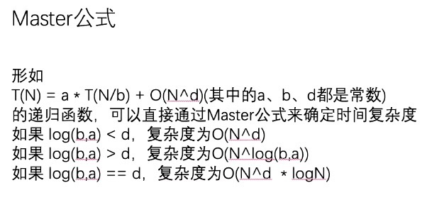

## Master 公式

### master 公式只针对于递归函数并且子规模一致的情况下使用

<!--<div align="center">-->




```
形如:
    T(N) = a * T(N/b) + O(N^d)(其中的a、b、d都是常数)
    的递归函数，可以直接通过Master公式来确定时间复杂度
    如果 log(b,a) < d，复杂度为O(N^d)
    如果 log(b,a) > d，复杂度为O(N^log(b,a))
    如果 log(b,a) == d，复杂度为O(N^d  * logN)

讲解:
    算法体系班: 第3节 一些基础的数据结构 (01:53:00)
```