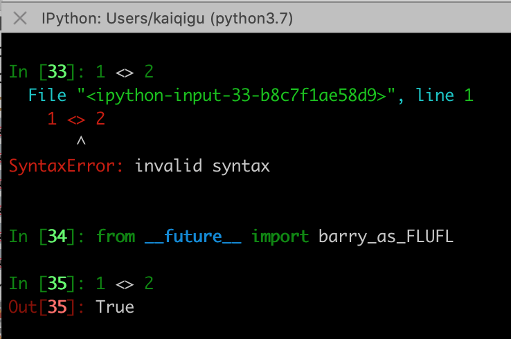

# python3 较 Python2 的差异

1. python3 print为函数,调用加(), python2 为方法,()可加可不加。

2. python3 源码文件以 UTF-8 编码，所有字符串都是 unicode 字符串; python2 字符串为string。

3. python3 可以用中文作为变量名，非 ASCII 标识符也是允许的了(python2中文变量名不被允许)。

4. python3 True和False 是关键字, python 2 中为全局变量。

5. Pyhton3 已不支持 <> 运算符，可以使用 != 代替, python2 <> 代表不等于
   可以使用以下的方式：

   <!---->
   ```
    In [34]: from __future__ import barry_as_FLUFL

    In [35]: 1 <> 2
    Out[35]: True
   ```

6. python3 对 python2 除法 "/" 修改

    python 2
    ```
    In [13]: 3/2
    Out[13]: 1

    In [14]: 3//2
    Out[14]: 1
    ```
    python 3
    ```
    In [36]: 3/2
    Out[36]: 1.5

    In [37]: 3//2
    Out[37]: 1
    ```
7. python3 废弃 cmp, 使用 (x>y)-(x<y) 替换; python2 如果 x < y 返回 -1, 如果 x == y 返回 0, 如果 x > y 返回 1。

8. 在 Python 3.8 的版本中可以使用 = 符号来拼接运算表达式与结果：

    python 3.7
    ```
    In [47]: x = 1

    In [48]: f'{x+1}'
    Out[48]: '2'
    ```
    python 3.8
    ```
    In [1]: x = 1

    In [2]: f'{x+1}'
    Out[2]: '2'

    In [3]: f'{x+1=}'
    Out[3]: 'x+1=2'

    ```

