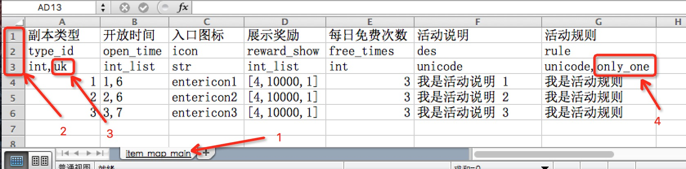
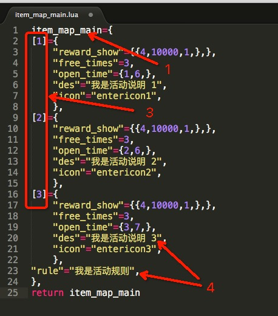

# 将excel配置转换成lua配置

#### trans_config.py  [下载](../python_script/id_number_verify.py)


### 格式说明
```
bool:                   bool 值
int:                    整型,
float:                  浮点型
str:                    字符串
unicode:                文字 unicode编码
int_list:               列表, 里面元素全部为整型
str_list:               列表, 里面元素全部为字符串
unicode_list:           列表, 里面元素全部为unicode
mix_str_list:           列表, 里面元素为数字字符串组合
mix_unicode_list:       列表, 里面元素为数字unicode组合
uk:                     特殊需求: 原样返回, 主键 和其他类型配合使用
only_one:               特殊需求: 原样返回, 配置只有一列和其他类型配合使用
```

### 效果对比


#### 原先excel配置(图一)

   

#### 生成的lua配置(图二)

   
   

### 使用规则

* (1) 图一中 箭头1 配置签命名规则, 必须全部为 数字.字符.下划线 组成
* (2) 图一中 箭头2 三行表示意义:

    ```
    第1行 为说明行, 给配表人查看对应内容(对转换配置无实际意义)
    第2行 为字段行, 生成配置对应的字段名
    第3行 为字段类型行, 字段对应数据类型
    ```


* (3) 图一中 箭头3 使用了 uk, 请参照图二中箭头3理解其意义
* (4) 图一中 箭头4 使用了 only_one, 请参照图二中箭头4理解其意义

